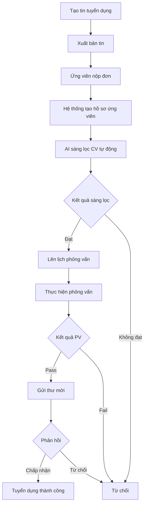

# TÓM TẮT CÁC USE CASE CHÍNH - HỆ THỐNG HRM TECHLEET

## THÔNG TIN CHUNG

**Hệ thống:** TechLeet - Human Resource Management System  
**Kiến trúc:** Microservices (User Service, Company Service, Recruitment Service, API Gateway)  
**Công nghệ:** NestJS, TypeScript, PostgreSQL, Redis, Kafka, AI/ML

---

## TỔNG QUAN

| Chỉ số                | Số lượng |
| --------------------- | -------- |
| **Tổng số Use Cases** | 20       |
| **Số Module**         | 8        |
| **Số Actor**          | 7        |
| **Số Microservice**   | 4        |

---

## DANH SÁCH ACTOR

1. **Ứng viên (Candidate)** - Người nộp đơn ứng tuyển
2. **Nhân viên (Employee)** - Nhân viên công ty
3. **Nhà tuyển dụng (Recruiter)** - Người phụ trách tuyển dụng
4. **Quản lý tuyển dụng (Hiring Manager)** - Quản lý quy trình tuyển
5. **Người phỏng vấn (Interviewer)** - Người thực hiện phỏng vấn
6. **Quản trị viên (Admin)** - Quản trị hệ thống
7. **HR Manager** - Quản lý nhân sự cấp cao

---

## 20 USE CASE CHÍNH THEO MODULE

### 1️⃣ XÁC THỰC & PHÂN QUYỀN (2 use cases)

- ✅ **UC-01:** Đăng nhập hệ thống
- ✅ **UC-02:** Quản lý phân quyền

### 2️⃣ QUẢN LÝ NHÂN VIÊN (2 use cases)

- ✅ **UC-03:** Quản lý hồ sơ nhân viên (CRUD, tìm kiếm, lọc)
- ✅ **UC-04:** Xem hồ sơ cá nhân

### 3️⃣ QUẢN LÝ TỔ CHỨC (2 use cases)

- ✅ **UC-05:** Quản lý phòng ban (CRUD + tìm kiếm)
- ✅ **UC-06:** Quản lý vị trí công việc (CRUD + tìm kiếm)

### 4️⃣ QUẢN LÝ TIN TUYỂN DỤNG (3 use cases)

- ✅ **UC-07:** Tạo và quản lý tin tuyển dụng
- ✅ **UC-08:** Xuất bản tin tuyển dụng
- ✅ **UC-09:** Xem danh sách tin tuyển dụng (lọc, tìm kiếm)

### 5️⃣ QUẢN LÝ ỨNG VIÊN (2 use cases)

- ✅ **UC-10:** Quản lý hồ sơ ứng viên (tạo, cập nhật, trạng thái)
- ✅ **UC-11:** Tìm kiếm ứng viên (theo kỹ năng, kinh nghiệm)

### 6️⃣ QUẢN LÝ ĐƠN ỨNG TUYỂN (3 use cases)

- ✅ **UC-12:** Nộp đơn ứng tuyển (Upload CV)
- ✅ **UC-13:** Quản lý đơn ứng tuyển (xem, cập nhật trạng thái)
- ✅ **UC-14:** Gửi và phản hồi thư mời làm việc

### 7️⃣ QUẢN LÝ PHỎNG VẤN (3 use cases)

- ✅ **UC-15:** Lên lịch phỏng vấn
- ✅ **UC-16:** Xem và quản lý lịch phỏng vấn
- ✅ **UC-17:** Hoàn thành phỏng vấn và đánh giá

### 8️⃣ SÀNG LỌC CV TỰ ĐỘNG - AI ⭐ (3 use cases)

- ✅ **UC-18:** Sàng lọc CV tự động bằng AI (OCR + NLP + AI Scoring)
- ✅ **UC-19:** Xem kết quả sàng lọc CV (điểm số, thông tin trích xuất)
- ✅ **UC-20:** Xem thống kê sàng lọc CV

---

## LUỒNG QUY TRÌNH NGHIỆP VỤ CHÍNH

### 🔄 QUY TRÌNH TUYỂN DỤNG (End-to-End)

**Các bước chi tiết:**

1. Hiring Manager tạo và xuất bản tin tuyển dụng
2. Ứng viên nộp đơn online
3. Hệ thống tự động tạo hồ sơ và gửi email xác nhận
4. AI tự động sàng lọc và đánh giá CV
5. Recruiter xem kết quả và quyết định
6. Lên lịch phỏng vấn cho ứng viên đạt yêu cầu
7. Người phỏng vấn đánh giá và cho điểm
8. Gửi thư mời cho ứng viên xuất sắc
9. Ứng viên phản hồi chấp nhận/từ chối
10. Cập nhật trạng thái cuối cùng

---

## PHÂN LOẠI 20 USE CASE THEO MỨC ĐỘ ƯU TIÊN

### 🔴 CRITICAL (Mức 1 - Core Features) - 8 use cases

1. **UC-01:** Đăng nhập hệ thống
2. **UC-07:** Tạo và quản lý tin tuyển dụng
3. **UC-08:** Xuất bản tin tuyển dụng
4. **UC-10:** Quản lý hồ sơ ứng viên
5. **UC-12:** Nộp đơn ứng tuyển
6. **UC-15:** Lên lịch phỏng vấn
7. **UC-18:** Sàng lọc CV tự động bằng AI ⭐
8. **UC-19:** Xem kết quả sàng lọc CV

### 🟡 HIGH (Mức 2 - Essential Features) - 8 use cases

- **UC-02:** Quản lý phân quyền
- **UC-03:** Quản lý hồ sơ nhân viên
- **UC-05:** Quản lý phòng ban
- **UC-06:** Quản lý vị trí công việc
- **UC-09:** Xem danh sách tin tuyển dụng
- **UC-11:** Tìm kiếm ứng viên
- **UC-13:** Quản lý đơn ứng tuyển
- **UC-17:** Hoàn thành phỏng vấn và đánh giá

### 🟢 MEDIUM (Mức 3 - Supporting Features) - 4 use cases

- **UC-04:** Xem hồ sơ cá nhân
- **UC-14:** Gửi và phản hồi thư mời làm việc
- **UC-16:** Xem và quản lý lịch phỏng vấn
- **UC-20:** Xem thống kê sàng lọc CV

---

## ĐIỂM NỔI BẬT CỦA HỆ THỐNG

### 🤖 AI-Powered CV Screening

- **Tự động sàng lọc CV** bằng AI/ML
- **Trích xuất thông tin** từ CV (OCR + NLP)
- **Đánh giá ứng viên** dựa trên yêu cầu công việc
- **Xử lý hàng loạt** nhiều CV cùng lúc
- **Hỗ trợ đa ngôn ngữ** (Tiếng Việt, Tiếng Anh)

### 🏗️ Kiến trúc Microservices

- **Độc lập**: Mỗi service có database riêng
- **Mở rộng dễ dàng**: Horizontal scaling
- **Resilient**: Fault tolerance
- **API Gateway**: Centralized routing

### 📧 Tự động hóa

- Gửi email tự động cho mọi sự kiện
- Tạo mã nhân viên tự động
- Xử lý CV tự động
- Webhook integration

### 🔒 Bảo mật

- JWT authentication
- Role-based access control
- Bearer token authorization
- Password encryption

### 🌏 Bản địa hóa

- Định dạng VND
- Múi giờ Việt Nam
- Số điện thoại Việt Nam
- OCR tiếng Việt

---

## KẾT QUẢ MONG ĐỢI

### Lợi ích cho tổ chức:

✅ Giảm 70% thời gian sàng lọc CV thủ công  
✅ Tăng 50% chất lượng ứng viên được chọn  
✅ Tự động hóa 80% quy trình tuyển dụng  
✅ Quản lý tập trung toàn bộ quy trình  
✅ Dữ liệu và báo cáo real-time

### Lợi ích cho ứng viên:

✅ Nộp đơn online dễ dàng  
✅ Nhận phản hồi nhanh chóng  
✅ Theo dõi tiến độ ứng tuyển  
✅ Trải nghiệm ứng tuyển chuyên nghiệp

---

## CÔNG NGHỆ SỬ DỤNG

| Lớp               | Công nghệ                                |
| ----------------- | ---------------------------------------- |
| **Backend**       | NestJS, TypeScript                       |
| **Database**      | PostgreSQL, Redis                        |
| **Message Queue** | Apache Kafka                             |
| **AI/ML**         | NLP, Text Embedding, LLM, Tesseract OCR  |
| **Email**         | Brevo (SendinBlue)                       |
| **Documentation** | Swagger/OpenAPI                          |
| **Architecture**  | Microservices, API Gateway, Event-Driven |

---

## THỐNG KÊ

- **Tổng số Use Cases:** 20
- **Use Cases Core:** 8 (40%)
- **Use Cases Essential:** 8 (40%)
- **Use Cases Supporting:** 4 (20%)
- **Số Actor:** 7
- **Số Module:** 8
- **Số API Endpoints:** 100+
- **Số Microservices:** 4

---

**Tài liệu chi tiết:** [USE_CASES.md](./USE_CASES.md)
