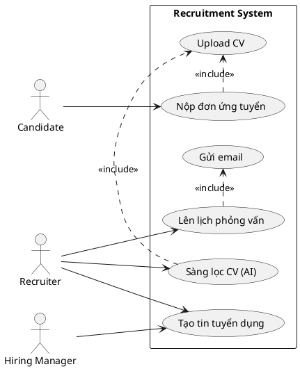

# MÔ TẢ USE CASE DIAGRAM - HỆ THỐNG HRM TECHLEET

## I. SƠ ĐỒ TỔNG QUAN HỆ THỐNG

### Actors và Relationships

```
┌─────────────────────────────────────────────────────────────────────────┐
│                     HỆ THỐNG HRM TECHLEET                                │
└─────────────────────────────────────────────────────────────────────────┘

ACTORS:
┌─────────────┐
│  Candidate  │ (Ứng viên)
└─────────────┘

┌─────────────┐
│  Employee   │ (Nhân viên)
└─────────────┘

┌─────────────┐
│  Recruiter  │ (Nhà tuyển dụng)
└─────────────┘

┌──────────────────┐
│  Hiring Manager  │ (Quản lý tuyển dụng)
└──────────────────┘

┌──────────────┐
│ Interviewer  │ (Người phỏng vấn)
└──────────────┘

┌─────────────┐
│    Admin    │ (Quản trị viên)
└─────────────┘

┌─────────────┐
│  HR Manager │ (Quản lý nhân sự)
└─────────────┘
```

---

## II. USE CASE DIAGRAM CHI TIẾT THEO MODULE

### 1. AUTHENTICATION & AUTHORIZATION MODULE

```
┌────────────────────────────────────────────────────────────┐
│           AUTHENTICATION & AUTHORIZATION                    │
│                                                             │
│    ┌──────────────────┐                                    │
│    │   All Users      │                                    │
│    └────────┬─────────┘                                    │
│             │                                               │
│             ├──────► (Đăng nhập hệ thống)                  │
│             │                                               │
│             └──────► (Làm mới token)                       │
│                                                             │
│    ┌──────────────────┐                                    │
│    │  New Employee    │                                    │
│    └────────┬─────────┘                                    │
│             │                                               │
│             └──────► (Tạo mật khẩu)                        │
│                                                             │
│    ┌──────────────────┐                                    │
│    │      Admin       │                                    │
│    └────────┬─────────┘                                    │
│             │                                               │
│             └──────► (Quản lý phân quyền)                  │
│                                                             │
└────────────────────────────────────────────────────────────┘
```

---

### 2. EMPLOYEE MANAGEMENT MODULE

```
┌────────────────────────────────────────────────────────────┐
│              EMPLOYEE MANAGEMENT                            │
│                                                             │
│    ┌──────────────────┐                                    │
│    │   Admin/HR Mgr   │                                    │
│    └────────┬─────────┘                                    │
│             │                                               │
│             ├──────► (Tạo hồ sơ nhân viên)                │
│             │                                               │
│             ├──────► (Cập nhật thông tin nhân viên)       │
│             │                                               │
│             ├──────► (Xem danh sách nhân viên)            │
│             │           │                                   │
│             │           ├─ include ─► (Tìm kiếm)          │
│             │           │                                   │
│             │           ├─ include ─► (Lọc)               │
│             │           │                                   │
│             │           └─ include ─► (Phân trang)        │
│             │                                               │
│             └──────► (Tự động tạo mã nhân viên)           │
│                                                             │
│    ┌──────────────────┐                                    │
│    │    Employee      │                                    │
│    └────────┬─────────┘                                    │
│             │                                               │
│             └──────► (Xem hồ sơ cá nhân)                  │
│                                                             │
└────────────────────────────────────────────────────────────┘
```

---

### 3. COMPANY STRUCTURE MODULE

```
┌────────────────────────────────────────────────────────────┐
│            COMPANY STRUCTURE MANAGEMENT                     │
│                                                             │
│    ┌──────────────────┐                                    │
│    │   Admin/HR Mgr   │                                    │
│    └────────┬─────────┘                                    │
│             │                                               │
│             ├──────► (Quản lý trụ sở)                      │
│             │           │                                   │
│             │           ├─ include ─► (Tạo)               │
│             │           │                                   │
│             │           ├─ include ─► (Cập nhật)          │
│             │           │                                   │
│             │           ├─ include ─► (Xem)               │
│             │           │                                   │
│             │           └─ include ─► (Xóa)               │
│             │                                               │
│             ├──────► (Quản lý phòng ban)                   │
│             │           │                                   │
│             │           ├─ include ─► (CRUD operations)   │
│             │           │                                   │
│             │           ├─ include ─► (Tìm theo trụ sở)   │
│             │           │                                   │
│             │           └─ include ─► (Tìm theo loại)     │
│             │                                               │
│             └──────► (Quản lý vị trí)                      │
│                         │                                   │
│                         └─ include ─► (CRUD operations)   │
│                                                             │
└────────────────────────────────────────────────────────────┘
```

---

### 4. JOB POSTING MODULE

```
┌────────────────────────────────────────────────────────────────┐
│              JOB POSTING MANAGEMENT                             │
│                                                                 │
│    ┌──────────────────────┐                                    │
│    │ Hiring Mgr/Recruiter │                                    │
│    └────────┬─────────────┘                                    │
│             │                                                   │
│             ├──────► (Tạo tin tuyển dụng)                     │
│             │                                                   │
│             ├──────► (Cập nhật tin tuyển dụng)                │
│             │                                                   │
│             ├──────► (Xem danh sách tin)                      │
│             │           │                                       │
│             │           ├─ include ─► (Lọc theo trạng thái)   │
│             │           │                                       │
│             │           ├─ include ─► (Lọc theo phòng ban)    │
│             │           │                                       │
│             │           └─ include ─► (Tìm kiếm)              │
│             │                                                   │
│             └──────► (Xem chi tiết tin)                       │
│                                                                 │
│    ┌──────────────────────┐                                    │
│    │   Hiring Manager     │                                    │
│    └────────┬─────────────┘                                    │
│             │                                                   │
│             ├──────► (Xuất bản tin)                           │
│             │           │                                       │
│             │           └─ extends ─► (Kiểm tra deadline)     │
│             │                                                   │
│             ├──────► (Đóng tin tuyển dụng)                    │
│             │                                                   │
│             └──────► (Xóa tin tuyển dụng)                     │
│                                                                 │
│    ┌──────────────────────┐                                    │
│    │      Candidate       │                                    │
│    └────────┬─────────────┘                                    │
│             │                                                   │
│             ├──────► (Xem tin tuyển dụng công khai)           │
│             │                                                   │
│             └──────► (Xem chi tiết tin)                       │
│                                                                 │
└────────────────────────────────────────────────────────────────┘
```

---

### 5. CANDIDATE MODULE

```
┌────────────────────────────────────────────────────────────────┐
│              CANDIDATE MANAGEMENT                               │
│                                                                 │
│    ┌──────────────────────┐                                    │
│    │      Recruiter       │                                    │
│    └────────┬─────────────┘                                    │
│             │                                                   │
│             ├──────► (Tạo hồ sơ ứng viên)                     │
│             │                                                   │
│             ├──────► (Cập nhật hồ sơ ứng viên)                │
│             │                                                   │
│             ├──────► (Xem danh sách ứng viên)                 │
│             │           │                                       │
│             │           ├─ include ─► (Lọc theo trạng thái)   │
│             │           │                                       │
│             │           ├─ include ─► (Lọc theo kinh nghiệm)  │
│             │           │                                       │
│             │           └─ include ─► (Phân trang)            │
│             │                                                   │
│             ├──────► (Tìm kiếm theo kỹ năng)                  │
│             │                                                   │
│             ├──────► (Cập nhật trạng thái ứng viên)           │
│             │                                                   │
│             └──────► (Xóa hồ sơ ứng viên)                     │
│                                                                 │
│    ┌──────────────────────┐                                    │
│    │ Recruiter/Hiring Mgr │                                    │
│    └────────┬─────────────┘                                    │
│             │                                                   │
│             └──────► (Xem chi tiết ứng viên)                  │
│                                                                 │
└────────────────────────────────────────────────────────────────┘
```

---

### 6. APPLICATION MODULE

```
┌─────────────────────────────────────────────────────────────────┐
│              APPLICATION MANAGEMENT                              │
│                                                                  │
│    ┌──────────────────────┐                                     │
│    │      Candidate       │                                     │
│    └────────┬─────────────┘                                     │
│             │                                                    │
│             ├──────► (Nộp đơn ứng tuyển)                       │
│             │           │                                        │
│             │           ├─ include ─► (Upload CV)              │
│             │           │                                        │
│             │           └─ extends ─► (Kiểm tra đơn trùng)     │
│             │                                                    │
│             └──────► (Phản hồi thư mời)                        │
│                                                                  │
│    ┌──────────────────────┐                                     │
│    │      Recruiter       │                                     │
│    └────────┬─────────────┘                                     │
│             │                                                    │
│             ├──────► (Xem danh sách đơn)                       │
│             │           │                                        │
│             │           ├─ include ─► (Lọc theo trạng thái)    │
│             │           │                                        │
│             │           └─ include ─► (Lọc theo tin tuyển)     │
│             │                                                    │
│             ├──────► (Xem đơn theo tin tuyển)                  │
│             │                                                    │
│             ├──────► (Xem đơn của ứng viên)                    │
│             │                                                    │
│             ├──────► (Cập nhật trạng thái đơn)                 │
│             │                                                    │
│             └──────► (Xem chi tiết đơn)                        │
│                                                                  │
│    ┌──────────────────────┐                                     │
│    │   Hiring Manager     │                                     │
│    └────────┬─────────────┘                                     │
│             │                                                    │
│             ├──────► (Gửi thư mời làm việc)                    │
│             │           │                                        │
│             │           └─ include ─► (Gửi email)              │
│             │                                                    │
│             └──────► (Xóa đơn ứng tuyển)                       │
│                                                                  │
└─────────────────────────────────────────────────────────────────┘
```

---

### 7. INTERVIEW MODULE

```
┌─────────────────────────────────────────────────────────────────┐
│              INTERVIEW MANAGEMENT                                │
│                                                                  │
│    ┌──────────────────────┐                                     │
│    │ Recruiter/Hiring Mgr │                                     │
│    └────────┬─────────────┘                                     │
│             │                                                    │
│             ├──────► (Lên lịch phỏng vấn)                      │
│             │           │                                        │
│             │           ├─ include ─► (Kiểm tra trùng lịch)    │
│             │           │                                        │
│             │           └─ include ─► (Gửi email thông báo)    │
│             │                                                    │
│             ├──────► (Cập nhật lịch phỏng vấn)                 │
│             │                                                    │
│             ├──────► (Hủy lịch phỏng vấn)                      │
│             │                                                    │
│             └──────► (Xóa lịch phỏng vấn)                      │
│                                                                  │
│    ┌──────────────────────┐                                     │
│    │    Interviewer       │                                     │
│    └────────┬─────────────┘                                     │
│             │                                                    │
│             ├──────► (Xem lịch của tôi)                        │
│             │                                                    │
│             ├──────► (Xem lịch sắp tới)                        │
│             │                                                    │
│             ├──────► (Cập nhật trạng thái)                     │
│             │                                                    │
│             └──────► (Hoàn thành và đánh giá)                  │
│                         │                                        │
│                         ├─ include ─► (Cho điểm)               │
│                         │                                        │
│                         ├─ include ─► (Nhận xét)               │
│                         │                                        │
│                         └─ include ─► (Đề xuất vòng tiếp)      │
│                                                                  │
│    ┌──────────────────────┐                                     │
│    │  Recruiter/Hiring    │                                     │
│    └────────┬─────────────┘                                     │
│             │                                                    │
│             ├──────► (Xem danh sách lịch PV)                   │
│             │                                                    │
│             ├──────► (Xem lịch theo đơn ứng tuyển)             │
│             │                                                    │
│             └──────► (Xem chi tiết lịch PV)                    │
│                                                                  │
└─────────────────────────────────────────────────────────────────┘
```

---

### 8. AI CV SCREENING MODULE ⭐

```
┌─────────────────────────────────────────────────────────────────┐
│         AI-POWERED CV SCREENING (CORE FEATURE)                   │
│                                                                  │
│    ┌──────────────────────┐                                     │
│    │      Recruiter       │                                     │
│    └────────┬─────────────┘                                     │
│             │                                                    │
│             ├──────► (Kích hoạt sàng lọc CV)                   │
│             │           │                                        │
│             │           ├─ include ─► «System» Trích xuất text │
│             │           │                 │                      │
│             │           │                 └─ OCR (nếu cần)      │
│             │           │                                        │
│             │           ├─ include ─► «System» NLP Processing  │
│             │           │                                        │
│             │           ├─ include ─► «System» Embedding       │
│             │           │                                        │
│             │           └─ include ─► «System» AI Scoring      │
│             │                                                    │
│             ├──────► (Sàng lọc hàng loạt)                      │
│             │           │                                        │
│             │           └─ include ─► «System» Queue Manager   │
│             │                                                    │
│             ├──────► (Xem kết quả sàng lọc)                    │
│             │           │                                        │
│             │           ├─ include ─► Điểm tổng thể            │
│             │           │                                        │
│             │           ├─ include ─► Điểm chi tiết            │
│             │           │                                        │
│             │           ├─ include ─► Thông tin trích xuất     │
│             │           │                                        │
│             │           └─ include ─► Đề xuất của AI           │
│             │                                                    │
│             ├──────► (Xem danh sách kết quả)                   │
│             │           │                                        │
│             │           ├─ include ─► (Lọc theo điểm)          │
│             │           │                                        │
│             │           ├─ include ─► (Lọc theo trạng thái)    │
│             │           │                                        │
│             │           └─ include ─► (Sắp xếp)                │
│             │                                                    │
│             ├──────► (Xem kết quả theo đơn ứng tuyển)          │
│             │                                                    │
│             ├──────► (Thử lại sàng lọc thất bại)               │
│             │                                                    │
│             ├──────► (Hủy quá trình sàng lọc)                  │
│             │                                                    │
│             ├──────► (Xem trạng thái hàng đợi)                 │
│             │                                                    │
│             └──────► (Xử lý lại CV của tin tuyển)              │
│                                                                  │
│    ┌──────────────────────┐                                     │
│    │   Hiring Manager     │                                     │
│    └────────┬─────────────┘                                     │
│             │                                                    │
│             └──────► (Xem thống kê sàng lọc)                   │
│                         │                                        │
│                         ├─ include ─► Tổng số CV sàng lọc      │
│                         │                                        │
│                         ├─ include ─► Điểm trung bình          │
│                         │                                        │
│                         ├─ include ─► Phân bố điểm             │
│                         │                                        │
│                         └─ include ─► Tỷ lệ đạt/không đạt      │
│                                                                  │
└─────────────────────────────────────────────────────────────────┘
```

---

### 9. FILE MANAGEMENT MODULE

```
┌─────────────────────────────────────────────────────────────────┐
│              FILE MANAGEMENT                                     │
│                                                                  │
│    ┌──────────────────────┐                                     │
│    │  Candidate/Recruiter │                                     │
│    └────────┬─────────────┘                                     │
│             │                                                    │
│             └──────► (Upload CV/Resume)                        │
│                         │                                        │
│                         └─ include ─► «System» Lưu trữ file    │
│                                                                  │
│    ┌──────────────────────┐                                     │
│    │       Admin          │                                     │
│    └────────┬─────────────┘                                     │
│             │                                                    │
│             └──────► (Upload logo công ty)                     │
│                                                                  │
│    ┌──────────────────────┐                                     │
│    │      «System»        │                                     │
│    └────────┬─────────────┘                                     │
│             │                                                    │
│             ├──────► (Xử lý OCR cho CV)                        │
│             │           │                                        │
│             │           ├─ Tesseract Engine                     │
│             │           │                                        │
│             │           ├─ Tiếng Việt support                   │
│             │           │                                        │
│             │           └─ Tiếng Anh support                    │
│             │                                                    │
│             ├──────► (Phân tích CV tự động)                    │
│             │           │                                        │
│             │           ├─ Trích xuất thông tin cá nhân        │
│             │           │                                        │
│             │           ├─ Trích xuất kinh nghiệm              │
│             │           │                                        │
│             │           ├─ Trích xuất học vấn                  │
│             │           │                                        │
│             │           └─ Trích xuất kỹ năng                  │
│             │                                                    │
│             ├──────► (Phân tích chứng chỉ)                     │
│             │                                                    │
│             └──────► (Xử lý webhook Brevo)                     │
│                                                                  │
└─────────────────────────────────────────────────────────────────┘
```

---

### 10. EMAIL MODULE

```
┌─────────────────────────────────────────────────────────────────┐
│              EMAIL MANAGEMENT (Automated)                        │
│                                                                  │
│    ┌──────────────────────┐                                     │
│    │      «System»        │                                     │
│    └────────┬─────────────┘                                     │
│             │                                                    │
│             ├──────► (Gửi email thông báo PV)                  │
│             │           │                                        │
│             │           └─ trigger: Khi tạo lịch PV            │
│             │                                                    │
│             ├──────► (Gửi email thư mời)                       │
│             │           │                                        │
│             │           └─ trigger: Khi tạo offer              │
│             │                                                    │
│             ├──────► (Gửi email từ chối)                       │
│             │           │                                        │
│             │           └─ trigger: Khi reject ứng viên        │
│             │                                                    │
│             └──────► (Gửi email xác nhận)                      │
│                         │                                        │
│                         └─ trigger: Khi nộp đơn                │
│                                                                  │
│                    «Brevo Email Service»                        │
│                         Integration                              │
│                                                                  │
└─────────────────────────────────────────────────────────────────┘
```

---

### 11. SYSTEM MONITORING MODULE

```
┌─────────────────────────────────────────────────────────────────┐
│              SYSTEM MONITORING                                   │
│                                                                  │
│    ┌──────────────────────┐                                     │
│    │   Admin/DevOps       │                                     │
│    └────────┬─────────────┘                                     │
│             │                                                    │
│             ├──────► (Health Check)                            │
│             │           │                                        │
│             │           ├─ API Gateway                          │
│             │           │                                        │
│             │           ├─ User Service                         │
│             │           │                                        │
│             │           ├─ Company Service                      │
│             │           │                                        │
│             │           └─ Recruitment Service                  │
│             │                                                    │
│             ├──────► (Xem tài liệu API)                        │
│             │           │                                        │
│             │           └─ Swagger UI                           │
│             │                                                    │
│             └──────► (Xem logs hệ thống)                       │
│                         │                                        │
│                         └─ Color-coded by service              │
│                                                                  │
└─────────────────────────────────────────────────────────────────┘
```

---

## III. LUỒNG TÍCH HỢP GIỮA CÁC MODULE

### Main Recruitment Workflow

```
┌─────────────────────────────────────────────────────────────────┐
│          LUỒNG TUYỂN DỤNG TÍCH HỢP                              │
│                                                                  │
│  [JOB POSTING]         [APPLICATION]         [CV SCREENING]     │
│       │                     │                      │            │
│       │ Tạo tin            │                      │            │
│       ├─────────┐          │                      │            │
│       │         │          │                      │            │
│       │ Xuất bản          │                      │            │
│       │         │          │                      │            │
│       │         └─────────►│ Nộp đơn             │            │
│       │                     ├──────────┐          │            │
│       │                     │          │          │            │
│       │                     │   Tạo ứng viên     │            │
│       │                     │          │          │            │
│       │                     │          └─────────►│ Sàng lọc AI│
│       │                     │                      │            │
│       │                     │                      │            │
│  [INTERVIEW]            [EMAIL]              [FILE]            │
│       │                     │                      │            │
│       │ Lên lịch PV        │                      │            │
│       ├────────────────────►│ Gửi thông báo       │            │
│       │                     │                      │            │
│       │                     │                      │ Upload CV  │
│       │                     │                      ├───────┐    │
│       │                     │                      │ OCR   │    │
│       │                     │                      │       │    │
│       │ Đánh giá           │                      │ Analyze│    │
│       ├─────────┐          │                      └───────┘    │
│       │         │          │                                    │
│       │ Pass    │          │                                    │
│       │         └─────────►│ Gửi offer                         │
│       │                     │                                    │
│       │                     │                                    │
└─────────────────────────────────────────────────────────────────┘
```

---

## IV. QUAN HỆ GIỮA CÁC USE CASE

### Include Relationships

- **Xem danh sách** → include → **Phân trang**
- **Xem danh sách** → include → **Tìm kiếm**
- **Xem danh sách** → include → **Lọc**
- **Nộp đơn ứng tuyển** → include → **Upload CV**
- **Sàng lọc CV** → include → **OCR**
- **Sàng lọc CV** → include → **NLP Processing**
- **Sàng lọc CV** → include → **AI Scoring**
- **Gửi thư mời** → include → **Gửi email**
- **Lên lịch PV** → include → **Gửi email thông báo**

### Extend Relationships

- **Xuất bản tin** → extends → **Kiểm tra deadline**
- **Nộp đơn** → extends → **Kiểm tra đơn trùng**
- **Lên lịch PV** → extends → **Kiểm tra trùng lịch**

---

## V. PACKAGES/SUBSYSTEMS

Hệ thống được tổ chức thành 4 subsystems (microservices):

```
┌───────────────────────────────────────────────────────────────┐
│                     «subsystem»                                │
│                    API GATEWAY                                 │
│  - Request Routing                                             │
│  - Authentication Middleware                                   │
│  - Swagger Aggregation                                         │
└───────────────────────────────────────────────────────────────┘

┌───────────────────────────────────────────────────────────────┐
│                     «subsystem»                                │
│                   USER SERVICE                                 │
│  - Authentication & Authorization Module                       │
│  - Employee Management Module                                  │
└───────────────────────────────────────────────────────────────┘

┌───────────────────────────────────────────────────────────────┐
│                     «subsystem»                                │
│                  COMPANY SERVICE                               │
│  - Company Structure Module                                    │
│  - Department Management                                       │
│  - Position Management                                         │
└───────────────────────────────────────────────────────────────┘

┌───────────────────────────────────────────────────────────────┐
│                     «subsystem»                                │
│                RECRUITMENT SERVICE                             │
│  - Job Posting Module                                          │
│  - Candidate Module                                            │
│  - Application Module                                          │
│  - Interview Module                                            │
│  - CV Screening Module (AI)                                    │
│  - File Management Module                                      │
│  - Email Module                                                │
└───────────────────────────────────────────────────────────────┘
```

---

## VI. HƯỚNG DẪN VẼ USE CASE DIAGRAM

### Công cụ đề xuất:

1. **Draw.io / diagrams.net** (Free, online)
2. **Lucidchart** (Professional)
3. **Microsoft Visio** (Professional)
4. **PlantUML** (Code-based)
5. **StarUML** (Desktop app)

### Các thành phần cần vẽ:

1. **Actors** (hình người que):

   - Candidate
   - Employee
   - Recruiter
   - Hiring Manager
   - Interviewer
   - Admin
   - HR Manager

2. **System Boundary** (hình chữ nhật bao quanh):

   - TechLeet HRM System
   - Các subsystem (nếu vẽ chi tiết)

3. **Use Cases** (hình oval):

   - 50+ use cases đã liệt kê

4. **Relationships** (đường nối):
   - Association (──)
   - Include (<<include>>)
   - Extend (<<extend>>)
   - Generalization (kế thừa)

### Gợi ý cách vẽ:

**Cách 1: Vẽ tổng quan (Overview)**

- 1 diagram duy nhất với tất cả actors và use cases chính (15-20 use cases quan trọng nhất)

**Cách 2: Vẽ theo module (Recommended)**

- 11 diagrams riêng cho mỗi module
- Mỗi diagram chi tiết hơn
- Dễ đọc và trình bày

**Cách 3: Vẽ theo subsystem**

- 4 diagrams cho 4 microservices
- Phản ánh đúng kiến trúc hệ thống

---

## VII. MẪU PLANTUM CODE (Optional)

Nếu muốn sử dụng PlantUML, có thể tham khảo cấu trúc sau:



---

**Kết luận:** Tài liệu này mô tả chi tiết cấu trúc Use Case Diagram cho hệ thống HRM TechLeet, giúp sinh viên có thể vẽ diagram chính xác cho báo cáo khóa luận.
